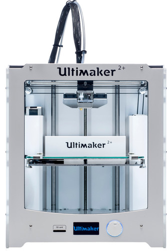
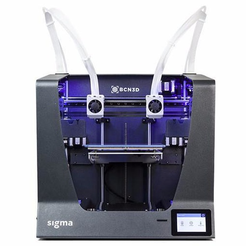

**Al onze 3D printers zijn FFF printers (Fused Filament Fabrication) waarbij we voornamelijk gebruik maken van het biologisch afbreekbare materiaal PLA. Hiermee kunnen er op een goedkope manier snel prototypes gemaakt worden.**

## Prusa i3 MK3

### Specificaties

- Print volume: 250 x 210 x 210 mm
- Slicer software: Slic3r
- Benodigd bestand: .STL of .OBJ
- Laaghoogte vanaf: 0.05 mm
- Mogelijke materialen: PLA, ABS, PET, HIPS, TPU, Nylon, etc

 
 

## Ultimaker 2+

### Specificaties

- Print volume: 223 x 223 x 205 mm
- Slicer software: Cura
- Benodigd bestand: .STL of .OBJ
- Laaghoogte vanaf: 0.05 mm
- Mogelijke materialen: PLA, ABS, CPE

 
 

## BCN3D Sigma

### Specificaties

- Print volume: 210 x 297 x 210 mm
- Aantal extruders: 2
- Slicer software: BCN3D Cura
- Benodigd bestand: .STL of .OBJ
- Laaghoogte vanaf: 0.05 mm
- Mogelijke materialen: PLA, ABS, PVA, TPE, HIPS, etc
