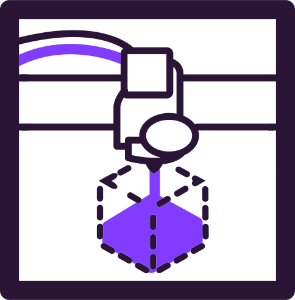
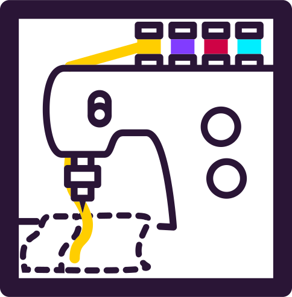
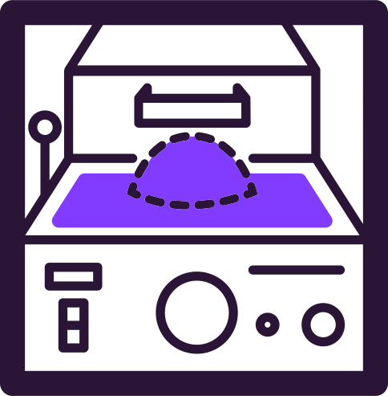
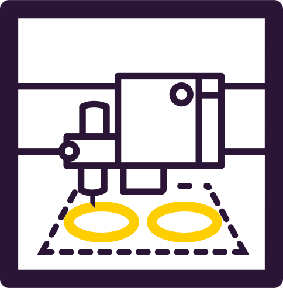
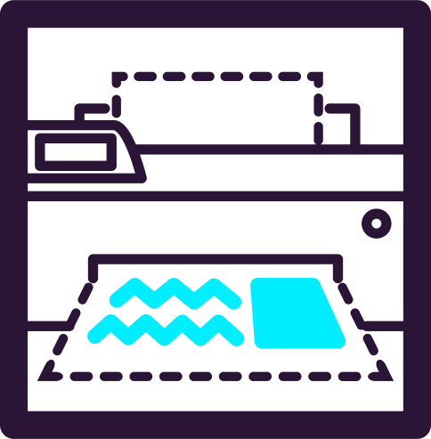

**Hieronder vind je verschillende soorten machines die we in het Stadslab hebben. Klik gerust verder om te bekijken wel machines er precies zijn.**

<a class="machine--link" href="{{site.baseurl}}/machines/3dprinters" title="Stadslab Rotterdam - 3D Printers">
    3D Printers
    
</a>
<a class="machine--link" href="{{site.baseurl}}/machines/lasercutters" title="Stadslab Rotterdam - Lasercutters">
    Lasercutters
    
</a>
<a class="machine--link" href="{{site.baseurl}}/machines/naaimachines" title="Stadslab Rotterdam - Naaimachines">
    Naaimachines
    
</a>
<a class="machine--link" href="{{site.baseurl}}/machines/vacuumformers" title="Stadslab Rotterdam - Vacuum Formers">
    Vacuum Formers
    
</a>
<a class="machine--link" href="{{site.baseurl}}/machines/vinylsnijders" title="Stadslab Rotterdam - Vinylsnijders">
    Vinylsnijders
    
</a>
<a class="machine--link" href="{{site.baseurl}}/machines/printers" title="Stadslab Rotterdam - Printers">
    Printers
    
</a>