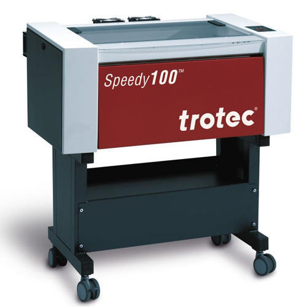
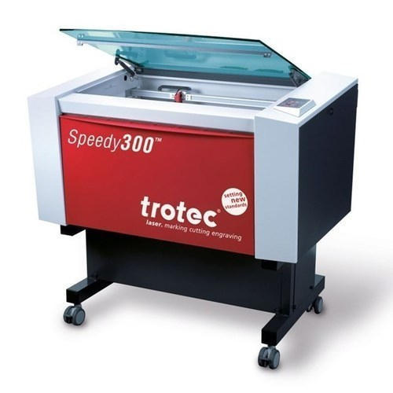
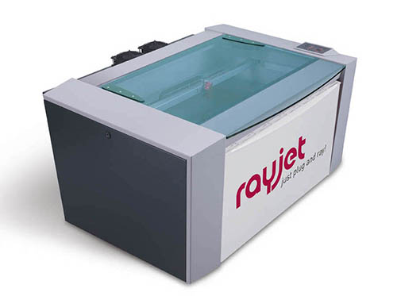

**Met een lasersnijder kun je materialen zoals hout, acryl of karton graveren of snijden. Voor alle drie de lasercutters is hetzelfde bestand benodigd, namelijk een .AI .DXF of .PDF bestand. De dikte van het materiaal kan (afhankelijk van het materiaal) max. 8 mm dik zijn.**

## Trotec Speedy 100

### Specificaties

- Max. werkruimte: 600 x 300 mm
- Lasertype: CO2
- Power: 60 W
- Max. materiaalhoogte: 157 mm
- Graveer snelheid: 180 cm/sec
- Accuratie: 0,01 mm

 
 

## Trotec Speedy 300

### Specificaties

- Max. werkruimte: 700 x 400 mm
- Lasertype: CO2
- Power: 30 W
- Max. materiaalhoogte: 157 mm
- Graveer snelheid: 180 cm/sec
- Accuratie: 0,01 mm
- Voor deze lasercutter hebben we ook een rondgraveermodule.

 
 

## Trotec Rayjet 300

### Specificaties

- Max. werkruimte: 700 x 400 mm
- Lasertype: CO2
- Power: 60 W
- Max. materiaalhoogte: 157 mm
- Graveer snelheid: 180 cm/sec
- Accuratie: 0,001 mm

Onze machines kunnen graveren en snijden in: acrylaat, hout, leer, textiel, papier, karton, vilt en meer. Onze machines kunnen alleen graveren in: metalen, glas, steen en meer. PVC of PVC-houdende materialen mogen niet gelaserd worden, in verband met de giftige gassen die hierbij worden veroorzaakt.

