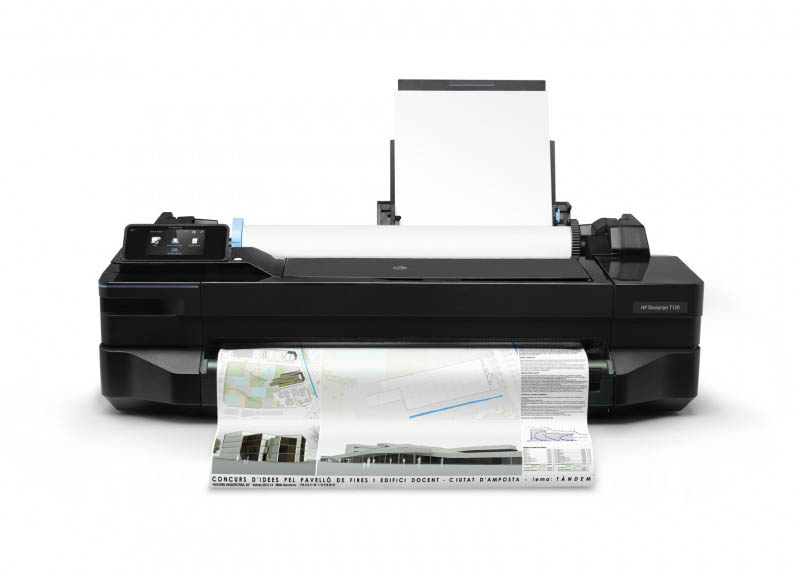

## HP Designjet T120 ePrinter

### Specificaties

- Afdrukkwaliteit (best)
	- Kleur: Tot 1200 x 1200 geoptimaliseerd dpi
	- Zwart: Tot 1200 x 1200 dpi geoptimaliseerde resolutie bij 600 x 600 dpi invoer met de instelling Optimalisatie voor fotopapier
- Printtechnologie: Thermische HP inkjettechnologie
- Aantal printcartridges: 4 (cyaan, magenta, geel, zwart)
- Type inkt: Inkt op kleurstofbasis (C, M, Y) op pigmentbasis (K)
- Niet-bedrukbaar gebied (losse vellen): 5 x 5 x 5 x 5 mm
- Gegarandeerde minimum lijnbreedte: 0,07 mm (ISO/IEC 13660:2001(E))[3]
- Lijnaccuratesse: ±0,1%[2]
- Benodigd document formaat: PDF

Kan zowel A1 als A2 printen