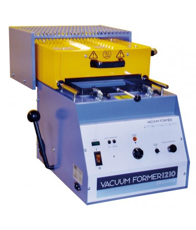
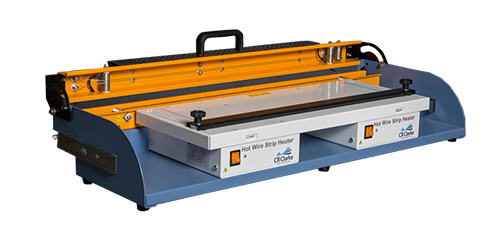
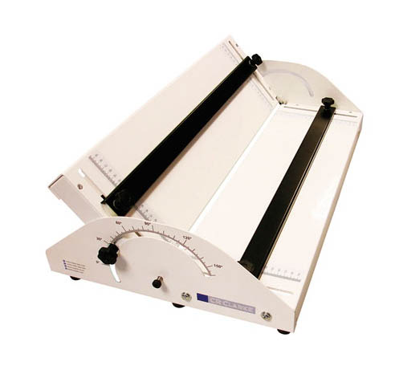

 

## Vacuum Former 1210 

### Specificaties

- Voltage: 230 50-60Hz
- Max Current: 6Amps
- Sheet Size: 305 x 228mm
- Maximum Material Thickness: 6mm
- Maximum Mould Height: 115mm

 
 

## Hot Wire Strip Heater 600D

### Specificaties

- Voltage: 230 or 115V 50-60Hz
- Max Current: 2 Amps
- Maximum Working Length: 600mm
- Maximum Material Thickness: 10mm

 
 

## Folding Jig FJ0600

### Specificaties

- Maximum Working Length: 600mm
- Maximum Stop to Bend Dimension: 50mm

