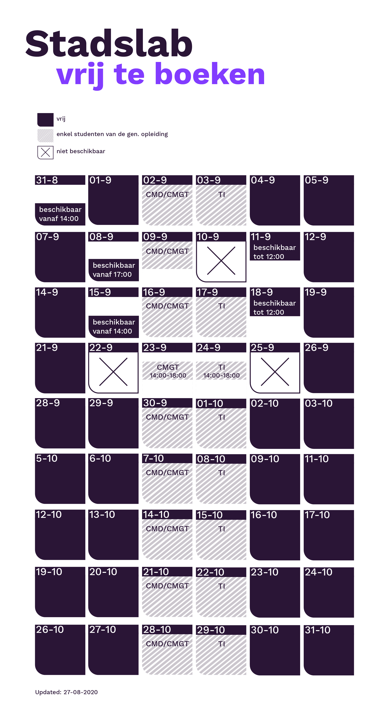

## Reserveren = verplicht! 

**Het Stadslab is tijdelijk gevestigd in de kelder van Museumpark (lokaal MP.L-1.241). Natuurlijk kun je ook buiten je lessen om gebruik maken van het Stadslab, om iets voor je project of gewoon iets leuks te maken. Ieder apparaat is te boeken via onze booking tool en daarnaast hebben we een aantal losse werkplekken. Er kunnen maximaal 14 studenten in het lab aan het werk, dus vol = vol! Bekijk ook onze kalender voor een overzicht op welke dagen je vrij kunt boeken.**

Wil je iets kopen in het winkeltje? Dan kun je natuurlijk gewoon binnen lopen, en als er al iemand bij de balie staat, even op de gang wachten.

Er zijn afspraken gemaakt over het openbaar vervoer voor reizen in de spits en het Stadslab valt buiten deze regeling. 

Onze openingstijden: \
Lesweek 1: ma t/m vrij 9-17 \
Andere weken: ma t/m do 9-21 en vrij 9-17 

We gaan open zaterdag mits er uiterlijk de donderdag ervoor reserveringen zijn geplaatst.

 
Link naar de booking tool:  
[https://outlook.office365.com/owa/calendar/Stadslab3@hrnl.onmicrosoft.com/bookings/](https://outlook.office365.com/owa/calendar/Stadslab3@hrnl.onmicrosoft.com/bookings/)

