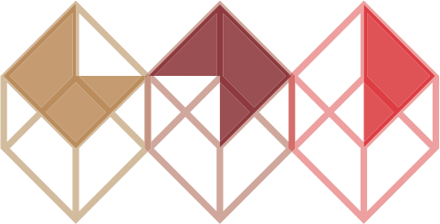

{: .logo}

**Het Stadslab heeft een winkeltje voor studenten met artikel die veel gebruikt worden binnen de opleidingen, zoals hardware, elektronica, markers etc. De artikelen die te koop zijn, vind je hier: [https://sites.google.com/a/hr.nl/stadslab-winkel-test/](https://sites.google.com/a/hr.nl/stadslab-winkel-test/)**

TI-studenten kunnen via [deze link](https://forms.office.com/Pages/ResponsePage.aspx?id=zrpvyrp8U02GgaBihPf_RhQ4pqYG-HRFuIRpqBerVOVUMDFXNDlKN0gwSEU3NFkwU1U2TTlXN1NSNyQlQCN0PWcu) een bestelling aanvragen voor hun project.

 <!--
Place this tag where you want the Awesome Table Widget to render
-->

Daarnaast heeft het Stadslab ook een uitleenbalie, waar je audiovisueel materiaal voor een bepaalde periode kunt lenen. De openingstijden zijn ma t/m vrij 9.00 - 17.00 uur.
De artikelen die je kunt lenen, vind je hier: [http://uitleen.cmi.hr.nl/ 
](http://uitleen.cmi.hr.nl/)

